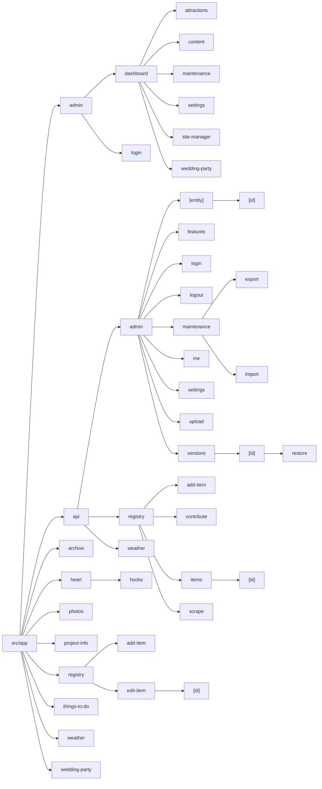

# Project Architecture

This document provides a high-level overview of the wedding website's architecture. The project is a full-stack application built with Next.js, leveraging its capabilities for both client-side rendering and server-side Route Handlers.

## Core Components

The application is composed of three main parts:

1.  **Frontend:** A React-based user interface built with Next.js App Router.
2.  **Backend:** Serverless Route Handlers built with Next.js App Router.
3.  **Database:** A PostgreSQL database managed with Prisma ORM.

## Environment Specifications

<!-- BEGIN AUTOGENERATED ENV -->
- **Node.js**: v22.x
- **Next.js**: ^16.2.6
- **React**: ^19.2.4
- **Prisma**: ^7.3.0
- **Zod**: ^4.4.3
<!-- END AUTOGENERATED ENV -->

```mermaid
graph TD
    subgraph Browser
        A[React Frontend]
    end

    subgraph Server (Vercel)
        B[Next.js Route Handlers]
        C[Prisma Client]
    end

    subgraph Database (Neon)
        D[PostgreSQL]
    end

    A -- HTTP Requests --> B
    B -- Queries --> C
    C -- TCP Connection --> D
```

### 1. Frontend

The frontend is built using [Next.js](https://nextjs.org/) and [React](https://react.dev/). It is responsible for rendering the user interface that guests and administrators interact with.

-   **Location:** `src/app/`
-   **Key Technologies:**
    -   **React:** For building UI components.
    -   **Next.js:** For App Router, server-side rendering, and client-side navigation.
    -   **Tailwind CSS:** For styling.
    -   **Framer Motion:** For animations.
    -   **React Query:** For managing server state, caching, and data fetching.
-   **Structure:**
    -   **App Router (`src/app/`):** Uses the Next.js App Router where directories define the routes and `page.tsx` renders the UI.
    -   **Components (`src/components/`):** Reusable UI elements are located here.
    -   **Admin UI:** A separate set of pages and components under `src/app/admin/` provides an interface for managing the website.

<!-- BEGIN AUTOGENERATED ROUTES -->


<!-- END AUTOGENERATED ROUTES -->

### 2. Backend (API)

The backend is a set of serverless functions implemented as Next.js Route Handlers. These routes handle business logic, data validation, and communication with the database.

-   **Location:** `src/app/api/`
-   **Key Technologies:**
    -   **Next.js Route Handlers:** For creating serverless API endpoints.
    -   **Prisma:** As the ORM for database access.
-   **Structure:**
    -   **Admin Routes (`src/app/api/admin/`):** Handle administrator authentication (login, logout, session checking).
    -   **Registry Routes (`src/app/api/registry/`):** Provide CRUD (Create, Read, Update, Delete) operations for registry items and handle guest contributions.
    -   **Scraper Route (`src/app/api/registry/scrape/`):** Contains the logic for fetching metadata from external product pages.

### 3. Database

The database stores all the data for the application, primarily the registry items and contributions.

-   **Location:** The schema is defined in `prisma/schema.prisma`.
-   **Key Technologies:**
    -   **PostgreSQL:** The relational database used for production (hosted on [Neon](https://neon.tech/)).
    -   **Prisma:** The ORM used to define the schema and interact with the database in a type-safe way.
-   **Data Models:**
    -   **`RegistryItem`:** Represents a single item in the gift registry.
    -   **`Contributor`:** Represents a contribution made by a guest towards a `RegistryItem`.

The use of Prisma allows for easy schema management through migrations and provides a type-safe client for querying the database from the backend API. The project was originally built with SQLite for local development and has since been migrated to PostgreSQL for production on Vercel.

### 4. Feature Organization

To maintain modularity and prevent logic smear, the codebase adopts a strict layered feature architecture. All domain-specific logic is encapsulated in isolated feature directories under `src/features/`.

-   **Location:** `src/features/`
-   **Structure:** Each feature contains:
    -   `api/`: Route handlers and server-side logic (e.g., proxying).
    -   `components/`: UI components specific to the feature.
    -   `hooks/`: Custom React hooks.
    -   `repository.ts`: Data access layer for Prisma queries.
    -   `service.ts`: Business logic layer.
    -   `schemas.ts`: Validation schemas (Zod).
    -   `types.ts`: TypeScript interfaces.
    -   `index.ts`: The public interface. To prevent cross-domain internal leakage, other modules must solely import from this file.

New features should be scaffolded using the included CLI utility (`npm run scaffold <feature-name>`) to ensure correct structural boundaries and naming conventions.

## System Configuration

The system uses a centrally defined configuration schema to validate runtime settings.

<!-- BEGIN AUTOGENERATED CONFIG -->
| Field | Type | Description |
|---|---|---|
| `id` | `string` | Configuration field for id |
| `brideName` | `string` | Configuration field for brideName |
| `groomName` | `string` | Configuration field for groomName |
| `weddingDate` | `date` | Configuration field for weddingDate |
| `baseUrl` | `string` | Configuration field for baseUrl |
| `venueName` | `string` | Configuration field for venueName |
| `venueAddress` | `string` | Configuration field for venueAddress |
| `venueCity` | `string` | Configuration field for venueCity |
| `venueState` | `string` | Configuration field for venueState |
| `venueZip` | `string` | Configuration field for venueZip |
| `latitude` | `number` | Configuration field for latitude |
| `longitude` | `number` | Configuration field for longitude |
| `storyText` | `string` | Configuration field for storyText |
| `venueDescription` | `string` | Configuration field for venueDescription |
| `travelAdvice` | `string` | Configuration field for travelAdvice |
| `heroTitle` | `string` | Configuration field for heroTitle |
| `heroSubtitle` | `string` | Configuration field for heroSubtitle |
| `seoTitle` | `string` | Configuration field for seoTitle |
| `seoDescription` | `string` | Configuration field for seoDescription |
| `adminPassword` | `string` | Configuration field for adminPassword |
| `themePrimary` | `string` | Configuration field for themePrimary |
| `themeSecondary` | `string` | Configuration field for themeSecondary |
| `themeAccent` | `string` | Configuration field for themeAccent |
| `faviconUrl` | `string` | Configuration field for faviconUrl |
| `ogImageUrl` | `string` | Configuration field for ogImageUrl |
| `seoKeywords` | `string` | Configuration field for seoKeywords |
| `features` | `pipe` | Configuration field for features |
| `createdAt` | `date` | Configuration field for createdAt |
| `updatedAt` | `date` | Configuration field for updatedAt |

<!-- END AUTOGENERATED CONFIG -->
