# Project Architecture

This document provides a high-level overview of the wedding website's architecture. The project is a full-stack application built with Next.js, leveraging its capabilities for both client-side rendering and server-side Route Handlers.

## Core Components

The application is composed of three main parts:

1.  **Frontend:** A React-based user interface built with Next.js App Router.
2.  **Backend:** Serverless Route Handlers built with Next.js App Router.
3.  **Database:** A PostgreSQL database managed with Prisma ORM.

## Environment Specifications

<!-- BEGIN AUTOGENERATED ENV -->
- **Node.js**: v22.x
- **Next.js**: ^16.2.6
- **React**: ^19.2.4
- **Prisma**: ^7.3.0
- **Zod**: ^4.4.3
<!-- END AUTOGENERATED ENV -->

```mermaid
graph TD
    subgraph Browser
        A[React Frontend]
    end

    subgraph Server (Vercel)
        B[Next.js Route Handlers]
        C[Prisma Client]
    end

    subgraph Database (Neon)
        D[PostgreSQL]
    end

    A -- HTTP Requests --> B
    B -- Queries --> C
    C -- TCP Connection --> D
```

### 1. Frontend

The frontend is built using [Next.js](https://nextjs.org/) and [React](https://react.dev/). It is responsible for rendering the user interface that guests and administrators interact with.

-   **Location:** `src/app/`
-   **Key Technologies:**
    -   **React:** For building UI components.
    -   **Next.js:** For App Router, server-side rendering, and client-side navigation.
    -   **Tailwind CSS:** For styling.
    -   **Framer Motion:** For animations.
    -   **React Query:** For managing server state, caching, and data fetching.
-   **Structure:**
    -   **App Router (`src/app/`):** Uses the Next.js App Router where directories define the routes and `page.tsx` renders the UI.
    -   **Components (`src/components/`):** Reusable UI elements are located here.
    -   **Admin UI:** A separate set of pages and components under `src/app/admin/` provides an interface for managing the website.

```mermaid
flowchart LR
    classDef page fill:#0284c7,stroke:#0369a1,color:#ffffff,stroke-width:2px;
    classDef api fill:#4c1d95,stroke:#3b82f6,color:#ffffff,stroke-width:2px;

    App["src/app"]
    node_admin["admin"]
    node_admin_dashboard["dashboard"]
    node_admin_dashboard_attractions["attractions"]
    node_admin_dashboard_content["content"]
    node_admin_dashboard_history["history"]
    node_admin_dashboard_maintenance["maintenance"]
    node_admin_dashboard_media["media"]
    node_admin_dashboard_settings["settings"]
    node_admin_dashboard_sitemanager["site-manager"]
    node_admin_dashboard_weddingparty["wedding-party"]
    node_admin_login["login"]
    node_api["api"]
    node_api_admin["admin"]
    node_api_admin_entity["[entity]"]
    node_api_admin_entity_id["[id]"]
    node_api_admin_features["features"]
    node_api_admin_login["login"]
    node_api_admin_logout["logout"]
    node_api_admin_maintenance["maintenance"]
    node_api_admin_maintenance_export["export"]
    node_api_admin_maintenance_import["import"]
    node_api_admin_me["me"]
    node_api_admin_settings["settings"]
    node_api_admin_upload["upload"]
    node_api_admin_versions["versions"]
    node_api_admin_versions_id["[id]"]
    node_api_admin_versions_id_restore["restore"]
    node_api_media["media"]
    node_api_media_id["[id]"]
    node_api_registry["registry"]
    node_api_registry_additem["add-item"]
    node_api_registry_contribute["contribute"]
    node_api_registry_items["items"]
    node_api_registry_items_id["[id]"]
    node_api_registry_scrape["scrape"]
    node_api_weather["weather"]
    node_archive["archive"]
    node_heart["heart"]
    node_photos["photos"]
    node_projectinfo["project-info"]
    node_registry["registry"]
    node_registry_additem["add-item"]
    node_registry_edititem["edit-item"]
    node_registry_edititem_id["[id]"]
    node_thingstodo["things-to-do"]
    node_weather["weather"]
    node_weddingparty["wedding-party"]
    App --> node_admin
    node_admin --> node_admin_dashboard
    node_admin_dashboard --> node_admin_dashboard_attractions
    node_admin_dashboard --> node_admin_dashboard_content
    node_admin_dashboard --> node_admin_dashboard_history
    node_admin_dashboard --> node_admin_dashboard_maintenance
    node_admin_dashboard --> node_admin_dashboard_media
    node_admin_dashboard --> node_admin_dashboard_settings
    node_admin_dashboard --> node_admin_dashboard_sitemanager
    node_admin_dashboard --> node_admin_dashboard_weddingparty
    node_admin --> node_admin_login
    App --> node_api
    node_api --> node_api_admin
    node_api_admin --> node_api_admin_entity
    node_api_admin_entity --> node_api_admin_entity_id
    node_api_admin --> node_api_admin_features
    node_api_admin --> node_api_admin_login
    node_api_admin --> node_api_admin_logout
    node_api_admin --> node_api_admin_maintenance
    node_api_admin_maintenance --> node_api_admin_maintenance_export
    node_api_admin_maintenance --> node_api_admin_maintenance_import
    node_api_admin --> node_api_admin_me
    node_api_admin --> node_api_admin_settings
    node_api_admin --> node_api_admin_upload
    node_api_admin --> node_api_admin_versions
    node_api_admin_versions --> node_api_admin_versions_id
    node_api_admin_versions_id --> node_api_admin_versions_id_restore
    node_api --> node_api_media
    node_api_media --> node_api_media_id
    node_api --> node_api_registry
    node_api_registry --> node_api_registry_additem
    node_api_registry --> node_api_registry_contribute
    node_api_registry --> node_api_registry_items
    node_api_registry_items --> node_api_registry_items_id
    node_api_registry --> node_api_registry_scrape
    node_api --> node_api_weather
    App --> node_archive
    App --> node_heart
    App --> node_photos
    App --> node_projectinfo
    App --> node_registry
    node_registry --> node_registry_additem
    node_registry --> node_registry_edititem
    node_registry_edititem --> node_registry_edititem_id
    App --> node_thingstodo
    App --> node_weather
    App --> node_weddingparty
    class App page;
    class node_admin_dashboard page;
    class node_admin_dashboard_attractions page;
    class node_admin_dashboard_content page;
    class node_admin_dashboard_history page;
    class node_admin_dashboard_maintenance page;
    class node_admin_dashboard_media page;
    class node_admin_dashboard_settings page;
    class node_admin_dashboard_sitemanager page;
    class node_admin_dashboard_weddingparty page;
    class node_admin_login page;
    class node_api_admin_entity api;
    class node_api_admin_entity_id api;
    class node_api_admin_features api;
    class node_api_admin_login api;
    class node_api_admin_logout api;
    class node_api_admin_maintenance_export api;
    class node_api_admin_maintenance_import api;
    class node_api_admin_me api;
    class node_api_admin_settings api;
    class node_api_admin_upload api;
    class node_api_admin_versions api;
    class node_api_admin_versions_id_restore api;
    class node_api_media api;
    class node_api_media_id api;
    class node_api_registry_additem api;
    class node_api_registry_contribute api;
    class node_api_registry_items api;
    class node_api_registry_items_id api;
    class node_api_registry_scrape api;
    class node_api_weather api;
    class node_archive page;
    class node_heart page;
    class node_photos page;
    class node_projectinfo page;
    class node_registry page;
    class node_registry_additem page;
    class node_registry_edititem_id page;
    class node_thingstodo page;
    class node_weather page;
    class node_weddingparty page;
```

<!-- BEGIN AUTOGENERATED ROUTES -->


<!-- END AUTOGENERATED ROUTES -->

### 2. Backend (API)

The backend is a set of serverless functions implemented as Next.js Route Handlers. These routes handle business logic, data validation, and communication with the database.

-   **Location:** `src/app/api/`
-   **Key Technologies:**
    -   **Next.js Route Handlers:** For creating serverless API endpoints.
    -   **Prisma:** As the ORM for database access.
-   **Structure:**
    -   **Admin Routes (`src/app/api/admin/`):** Handle administrator authentication (login, logout, session checking).
    -   **Registry Routes (`src/app/api/registry/`):** Provide CRUD (Create, Read, Update, Delete) operations for registry items and handle guest contributions.
    -   **Scraper Route (`src/app/api/registry/scrape/`):** Contains the logic for fetching metadata from external product pages.

### 3. Database

The database stores all the data for the application, primarily the registry items and contributions.

-   **Location:** The schema is defined in `prisma/schema.prisma`.
-   **Key Technologies:**
    -   **PostgreSQL:** The relational database used for production (hosted on [Neon](https://neon.tech/)).
    -   **Prisma:** The ORM used to define the schema and interact with the database in a type-safe way.
-   **Data Models:**
    -   **`RegistryItem`:** Represents a single item in the gift registry.
    -   **`Contributor`:** Represents a contribution made by a guest towards a `RegistryItem`.

The use of Prisma allows for easy schema management through migrations and provides a type-safe client for querying the database from the backend API. The project uses PostgreSQL as the sole active database layer for both local development and production.

### 4. Feature Organization

To maintain modularity and prevent logic smear, the codebase adopts a strict layered feature architecture. All domain-specific logic is encapsulated in isolated feature directories under `src/features/`.

-   **Location:** `src/features/`
-   **Structure:** Each feature contains:
    -   `api/`: Route handlers and server-side logic (e.g., proxying).
    -   `components/`: UI components specific to the feature.
    -   `hooks/`: Custom React hooks.
    -   `repository.ts`: Data access layer for Prisma queries.
    -   `service.ts`: Business logic layer.
    -   `schemas.ts`: Validation schemas (Zod).
    -   `types.ts`: TypeScript interfaces.
    -   `index.ts`: The public interface. To prevent cross-domain internal leakage, other modules must solely import from this file.

New features should be scaffolded using the included CLI utility (`npm run scaffold <feature-name>`) to ensure correct structural boundaries and naming conventions.

### 5. Architectural Boundaries & Shared Components Guidelines

To prevent code duplication, maintain a highly maintainable and clean project structure, developers must respect the strict boundaries between generic (shared) directories and feature-specific directories.

#### Folder Boundaries
* **Generic Directories (`src/components/`, `src/components/ui/`, `src/utils/`, `src/lib/`):**
  * These directories must house ONLY domain-agnostic, reusable components, hooks, or helpers.
  * No feature-specific terminology, business rules, or Prisma/database imports should exist in these files.
  * For example, a generic `Button` or `Dialog` goes to `src/components/ui/`. A generic `cn` style merger goes to `src/utils/`.
* **Feature Directories (`src/features/<feature-name>/`):**
  * Feature directories contain all UI components, hooks, schema definitions, and business logic that belong strictly to that feature domain (e.g., weather, registry).
  * Feature-specific code must not be exposed globally; other domains can only import via the feature's public API (`src/features/<feature-name>/index.ts`).
  * If a utility or component in a feature becomes needed across multiple features, it must be refactored into a generic domain-agnostic form and relocated to the appropriate generic directory.

#### Structural Rules for Shared UI Primitives
Any new shared UI component/primitive added to `src/components/ui/` must adhere to the following rigid design and quality patterns:

1. **React Ref Forwarding:**
   * Components must allow the consumption of refs by utilizing `React.forwardRef` to pass the ref down to the root DOM node of the primitive.
   * *Example:*
     ```tsx
     import React from 'react';
     
     export interface InputProps extends React.InputHTMLAttributes<HTMLInputElement> {}
     
     export const Input = React.forwardRef<HTMLInputElement, InputProps>(
       ({ className, type, ...props }, ref) => {
         return (
           <input
             type={type}
             className={cn('border rounded px-3 py-2', className)}
             ref={ref}
             {...props}
           />
         );
       }
     );
     Input.displayName = 'Input';
     ```

2. **Style Composition / Class Merging:**
   * Primitives must be highly configurable from the outside. Default Tailwind styles must be merged with custom styles passed via the `className` prop.
   * This class merging MUST be done via the `cn(...)` utility (located in `src/utils/cn.ts`) to resolve Tailwind conflicts correctly.
   * *Example:*
     ```tsx
     import { cn } from '@/utils/cn';
     // Usage inside a component:
     className={cn('base-classes-here', className)}
     ```

3. **Unit Tests:**
   * Every new shared UI primitive must have a matching unit test file inside the respective `__tests__` directory (e.g., `src/components/ui/__tests__/<Component>.test.tsx`).
   * Unit tests must verify proper rendering, prop-based configuration, custom ref forwarding, and interactive behavior (e.g., fire events).

## System Configuration

The system uses a centrally defined configuration schema to validate runtime settings.

<!-- BEGIN AUTOGENERATED CONFIG -->
| Field | Type | Description |
|---|---|---|
| `id` | `string` | Configuration field for id |
| `brideName` | `string` | Configuration field for brideName |
| `groomName` | `string` | Configuration field for groomName |
| `weddingDate` | `date` | Configuration field for weddingDate |
| `baseUrl` | `string` | Configuration field for baseUrl |
| `venueName` | `string` | Configuration field for venueName |
| `venueAddress` | `string` | Configuration field for venueAddress |
| `venueCity` | `string` | Configuration field for venueCity |
| `venueState` | `string` | Configuration field for venueState |
| `venueZip` | `string` | Configuration field for venueZip |
| `latitude` | `number` | Configuration field for latitude |
| `longitude` | `number` | Configuration field for longitude |
| `storyText` | `string` | Configuration field for storyText |
| `venueDescription` | `string` | Configuration field for venueDescription |
| `travelAdvice` | `string` | Configuration field for travelAdvice |
| `heroTitle` | `string` | Configuration field for heroTitle |
| `heroSubtitle` | `string` | Configuration field for heroSubtitle |
| `seoTitle` | `string` | Configuration field for seoTitle |
| `seoDescription` | `string` | Configuration field for seoDescription |
| `faviconUrl` | `string` | Configuration field for faviconUrl |
| `ogImageUrl` | `string` | Configuration field for ogImageUrl |
| `seoKeywords` | `string` | Configuration field for seoKeywords |
| `showCountdown` | `default` | Configuration field for showCountdown |
| `showAddToCalendar` | `default` | Configuration field for showAddToCalendar |
| `features` | `pipe` | Configuration field for features |
| `createdAt` | `date` | Configuration field for createdAt |
| `updatedAt` | `date` | Configuration field for updatedAt |

<!-- END AUTOGENERATED CONFIG -->
